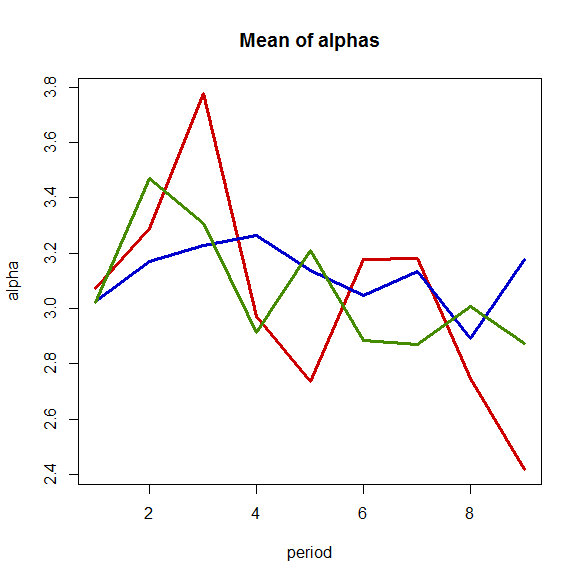

[](http://quantlet.de/index.php?p=info)

## [](http://quantlet.de/) **CCSAlphas** [](http://quantlet.de/d3/ia)

```yaml

Name of Quantlet : CCSAlphas

Published in : The Cross Section of Crypto-Currencies as Financial Asset

Description : Derives the alpha of the power law and plots them to compare them over time.

Keywords : Power Law, Crypto-Currencies, Alpha, Cross Section, plot

See also : 'CCSCryptoSurvival, CCSecdf, CCSHistMarketCap, CCSHistMarketCapHighValAreas,
CCSHistReturnsDensity, CCSMarketCapvsVol, CCSMeansRollingWindow, CCSPCAExVar, CCSSdRollingWindow'

Author : Simon Trimborn, Hermann Elendner

Submitted : Fri, September 16 2016 by Simon Trimborn

Datafile : data.RData

Example : 'A plot showing the evolution of the alpha parameter in 3 different groups of
crypto-currencies ordered by market capitalization.'

```




### R Code:
```r
rm(list=ls(all=TRUE))

# please change your working directory
#setwd("C:/...")

library(xts)
library(igraph)
load("data.RData")

crypto_returns_na = crypto_returns

## remove returns for days when volume is too low:
minvolthreshold                         = 10 # min 10USD vol per day for a return
issufficientvol                         = crypto_vol_xts > minvolthreshold
issufficientvol[is.na(issufficientvol)] = FALSE  # treat NA as not sufficient
issufficientvol                         = issufficientvol[-1, ] # drop 1st row as returns lose 1st row

crypto_returns_na[as.matrix(! issufficientvol)] = NA

## take absolute returns:
crypto_returns_na_abs = abs(crypto_returns_na)

marketcap_mean  = apply(crypto_market_xts, 2, mean, na.rm = T)
which1          = which(marketcap_mean <= 50000)
which2          = which(marketcap_mean > 50000 & marketcap_mean <= 500000)
which3          = which(marketcap_mean > 500000)

crypto_returns_na_abs_exc1 = crypto_returns_na_abs[, which1]
crypto_returns_na_abs_exc2 = crypto_returns_na_abs[, which2]
crypto_returns_na_abs_exc3 = crypto_returns_na_abs[, which3]

### alpha
### specify period and minimum data length 
alpha_list          = list()
max_length          = 0
length_alpha_per    = 90
min_data            = 60

### compute alphas
for (i in 1:dim(crypto_returns_na_abs)[2]){
    crypto_returns_na_abs_trim = na.trim(crypto_returns_na_abs[, i], 
        sides = "left")
    if (length(crypto_returns_na_abs_trim) < length_alpha_per) {
        alpha_list[[i]] = list(NULL)
        next
    }
    alpha_rounds    = floor(length(crypto_returns_na_abs_trim) / length_alpha_per)
    max_length      = if (max_length < alpha_rounds) {
        alpha_rounds
    } else {
        max_length
    }
    alphas = c()
    for (j in 1:alpha_rounds) {
        current_data = na.omit(crypto_returns_na_abs_trim[(1 + 
            length_alpha_per * (j - 1)):(length_alpha_per * j)])
        if (length(current_data) < min_data) {
            alphas[j] = NA
        } else {
            alphas[j] = power.law.fit(current_data)$alpha
        }
    }
    alpha_list[[i]] = alphas
}

# build matrix from list
alpha_matrix1 = matrix(NA, nrow = length(alpha_list), ncol = max_length)
alpha_matrix2 = matrix(NA, nrow = length(alpha_list), ncol = max_length)
alpha_matrix3 = matrix(NA, nrow = length(alpha_list), ncol = max_length)
for (j in 1:max_length) {
    for(i in which1) {
        if (!is.null(alpha_list[[i]][[1]])) {
            alpha_matrix1[i, j] = alpha_list[[i]][j]
        }
    }
    for(i in which2) {
        if (!is.null(alpha_list[[i]][[1]])) {
            alpha_matrix2[i, j] = alpha_list[[i]][j]
        }
    }
    for(i in which3) {
        if (!is.null(alpha_list[[i]][[1]])) {
            alpha_matrix3[i, j] = alpha_list[[i]][j]
        }
    }
}
alpha_matrix1[is.infinite(alpha_matrix1)] = NA
alpha_matrix2[is.infinite(alpha_matrix2)] = NA
alpha_matrix3[is.infinite(alpha_matrix3)] = NA

# make plot over means of alphas in periods
alpha_line1 = apply(alpha_matrix1, 2, mean, na.rm = TRUE)
alpha_line2 = apply(alpha_matrix2, 2, mean, na.rm = TRUE)
alpha_line3 = apply(alpha_matrix3, 2, mean, na.rm = TRUE)

plot(alpha_line1, col = "red3", lwd = 3, type = "l", ylab = "alpha", 
    xlab = "period", main = "Mean of alphas", ylim = c(min(alpha_line1, 
    alpha_line2, alpha_line3), max(alpha_line1, alpha_line2, alpha_line3)))
lines(alpha_line2, col = "blue3", lwd = 3, type = "l")
lines(alpha_line3, col = "chartreuse4", lwd = 3, type = "l")


```
