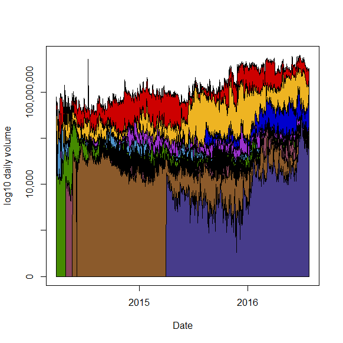

[](http://quantlet.de/index.php?p=info)

## [](http://quantlet.de/) **CCSCryptoSurvival** [](http://quantlet.de/d3/ia)

```yaml

Name of Quantlet : CCSCryptoSurvival

Published in : The Cross Section of Crypto-Currencies as Financial Asset

Description : 'Gives a plot visualizing the trading volume of the top 10 crypto-currencies by
market capitalization.'

Keywords : Trading volume, Crypto-Currencies, log, polygon, plot

See also : 'CCSAlphas, CCSecdf, CCSHistMarketCap, CCSHistMarketCapHighValAreas,
CCSHistReturnsDensity, CCSMarketCapvsVol, CCSMeansRollingWindow, CCSPCAExVar, CCSSdRollingWindow'

Author : Simon Trimborn, Hermann Elendner

Submitted : Fri, September 16 2016 by Simon Trimborn

Datafile : data.RData

Example : 'A plot visualizing the trading volume of the top 10 crypto-currencies by market
capitalization on a log10 scale.'

```




### R Code:
```r
rm(list=ls(all=TRUE))

# please change your working directory
#setwd("C:/...")

library(xts)
load("data.RData")

numb_cryptos    = 10
max_vol_cryptos = crypto_vol_xts[, max_cryptos]
order_max       = order(apply(max_vol_cryptos, 2, sum, na.rm = T), decreasing = T)
max_vol_cryptos = max_vol_cryptos[, order_max]
color           = color[order_max]
xx              = c(index(max_vol_cryptos[,1]), rev(index(max_vol_cryptos[,1])))

plot(x=index(max_vol_cryptos[, numb_cryptos]), y = log10(na.fill(max_vol_cryptos[, numb_cryptos], 1)), 
     type = "l", ylim = c(0, max(log10(na.fill(apply(max_vol_cryptos, 1, sum), 1)))), 
     ylab = "log10 daily volume", xlab = "Date", yaxt = "n")
polygon(xx, log10(c(rep(1, nrow(max_vol_cryptos[, numb_cryptos])), 
    rev(na.fill(max_vol_cryptos[, numb_cryptos], 1)))), col = color[numb_cryptos])
for (i in (numb_cryptos - 1):1) {
    yy1 = apply(max_vol_cryptos[, c(numb_cryptos:(i + 1))], 1, sum, na.rm=TRUE)
    yy2 = apply(max_vol_cryptos[, c(numb_cryptos:i)], 1, sum, na.rm=TRUE)
    yy1[which(yy1 == 0)] = 1
    yy2[which(yy2 == 0)] = 1
    polygon(xx, log10(c(yy1, rev(yy2))), col = color[i])
}
axis(2, c(0, 2, 4, 6, 8), labels = c("0", "", "10,000", "", "100,000,000"))
```
