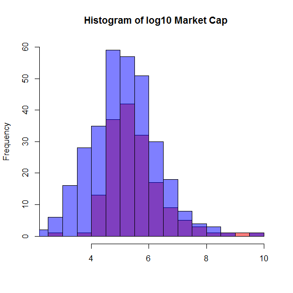

[](http://quantlet.de/index.php?p=info)

## [](http://quantlet.de/) **CCSHistMarketCapHighValAreas** [](http://quantlet.de/d3/ia)

```yaml

Name of Quantlet : CCSHistMarketCapHighValAreas

Published in : The Cross Section of Crypto-Currencies as Financial Asset

Description : 'Gives 2 histograms for the distribution of market capitalization of
crypto-currencies in 2 different time periods with a high overall market capitalization.'

Keywords : histogram, Crypto-Currencies, log, market capitalization, plot

See also : 'CCSAlphas, CCSCryptoSurvival, CCSecdf, CCSHistMarketCap, CCSHistReturnsDensity,
CCSMarketCapvsVol, CCSMeansRollingWindow, CCSPCAExVar, CCSSdRollingWindow'

Author : Simon Trimborn, Hermann Elendner

Submitted : Fri, September 16 2016 by Simon Trimborn

Datafile : data.RData

Example : 'A plot giving 2 histograms for the distribution of market capitalization of
crypto-currencies in 2 different time periods with a high overall market capitalization.'

```




### R Code:
```r
rm(list=ls(all=TRUE))

# please change your working directory
#setwd("C:/...")

library(xts)
load("data.RData")

hist(x=log10(na.omit(as.numeric(apply(crypto_market_xts["::2014-08"], 2, 
                                      mean, na.rm = TRUE)))), 
     main = "Histogram of log10 Market Cap", 
     breaks = 20, xlab = "", col = rgb(1,0,0,0.5), ylim = c(0,60))
hist(x=log10(na.omit(as.numeric(apply(crypto_market_xts["2016-01-01::"], 2, 
                                      mean, na.rm = TRUE)))), 
     breaks = 20, xlab = "", add = T, col = rgb(0,0,1,0.5))
```
