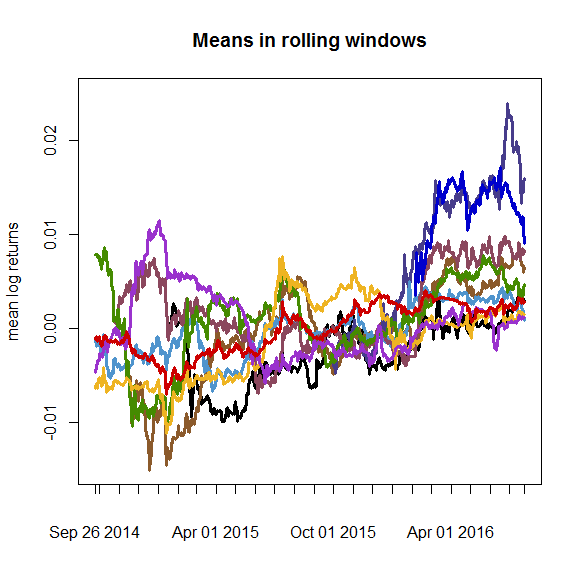

[](http://quantlet.de/index.php?p=info)

## [](http://quantlet.de/) **CCSMeansRollingWindow** [](http://quantlet.de/d3/ia)

```yaml

Name of Quantlet : CCSMeansRollingWindow

Published in : The Cross Section of Crypto-Currencies as Financial Asset

Description : 'Plots the mean log returns of the top 10 crypto-currencies by market capitalization
on a rolling window.'

Keywords : rolling window, Crypto-Currencies, log, returns, plot

See also : 'CCSAlphas, CCSCryptoSurvival, CCSecdf, CCSHistMarketCap, CCSHistMarketCapHighValAreas,
CCSHistReturnsDensity, CCSMarketCapvsVol, CCSPCAExVar, CCSSdRollingWindow'

Author : Simon Trimborn, Hermann Elendner

Submitted : Fri, September 16 2016 by Simon Trimborn

Datafile : data.RData

Example : 'A plot giving the mean log returns of the top 10 crypto-currencies by market
capitalization on a rolling window of 180 days.'

```




### R Code:
```r
rm(list=ls(all=TRUE))

# please change your working directory
#setwd("C:/...")

library(xts)
load("data.RData")

window_length = 180

mean_sd_window_comp = function(dat, w_l) {
    
    if (length(na.omit(dat)) - w_l < 0) {
        return(NA)
    }
    
    startdate   = index(head(dat[! is.na(dat)], 1))
    dat         = dat[paste0(startdate,"::")]
    
    enddates    = index(dat)[-(1:w_l)]
    mean_w      = xts(rep(NA, length(dat) - w_l), order.by=enddates)
    sd_w        = xts(rep(NA, length(dat) - w_l), order.by=enddates)
    
    for (enddate in enddates) {
        enddate         = as.Date(enddate)  # R for loop breaks class
        startdate       = enddate - w_l
        daterange       = paste0(startdate, "::", enddate)
        mean_w[enddate] = mean(dat[daterange], na.rm=TRUE)
        sd_w[enddate]   = sd(dat[daterange], na.rm=TRUE)
    }
    return(cbind(mean_w, sd_w))
}

mean_sd_list = list()
for (crypto in max_cryptos) {
    mean_sd_list[[crypto]] = mean_sd_window_comp(crypto_returns_selec_xts[, 
        crypto], window_length)
}

color = c("red3", "blue3", "darkorchid3", "goldenrod2", "chartreuse4", 
          "palevioletred4", "steelblue3", "slateblue4", "tan4", "black")
names(color) = max_cryptos
plot(mean_sd_list[[1]][, 1], type = "l", ylim = c(-0.015, 0.025), 
    auto.grid = FALSE, main = "Means in rolling windows", 
    ylab = "mean log returns", minor.ticks = FALSE)
for (j in length(max_cryptos):1) {
    lines(mean_sd_list[[j]][, 1], type = "l", col = color[j], lwd = 3)
}

```
