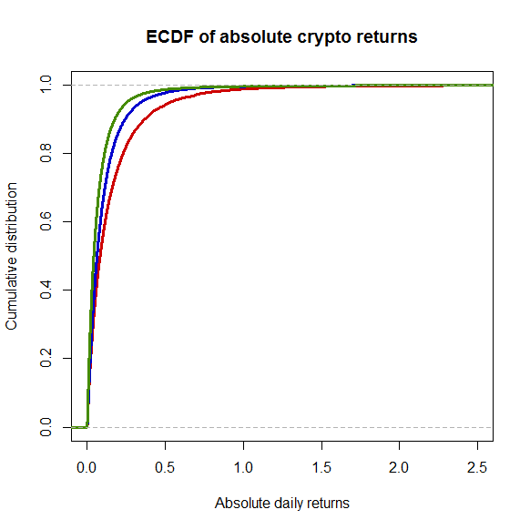

[](http://quantlet.de/index.php?p=info)

## [](http://quantlet.de/) **CCSecdf** [](http://quantlet.de/d3/ia)

```yaml

Name of Quantlet : CCSecdf

Published in : The Cross Section of Crypto-Currencies as Financial Asset

Description : 'Derives the ecdfs according to groups of crypto-currencies and plots them for
comparison.'

Keywords : ecdf, Crypto-Currencies, size effect, daily returns, plot

See also : 'CCSAlphas, CCSCryptoSurvival, CCSHistMarketCap, CCSHistMarketCapHighValAreas,
CCSHistReturnsDensity, CCSMarketCapvsVol, CCSMeansRollingWindow, CCSPCAExVar, CCSSdRollingWindow'

Author : Simon Trimborn, Hermann Elendner

Submitted : Fri, September 16 2016 by Simon Trimborn

Datafile : data.RData

Example : 'A plot showing the ecdf in 3 different groups of crypto-currencies ordered by market
capitalization.'

```




### R Code:
```r
rm(list=ls(all=TRUE))

# please change your working directory
#setwd("C:/...")

library(xts)
load("data.RData")

crypto_returns_na = crypto_returns
for (i in 1:dim(crypto_returns_na)[2]) {
    crypto_returns_na[which(crypto_returns_na[, i] == 0), i] = NA
}

## remove returns for days when volume is too low:
minvolthreshold                         = 10 # min 10USD vol per day for a return
issufficientvol                         = crypto_vol_xts > minvolthreshold
issufficientvol[is.na(issufficientvol)] = FALSE  # treat NA as not sufficient
issufficientvol                         = issufficientvol[-1, ] # drop 1st row as returns lose 1st row

crypto_returns_na[as.matrix(! issufficientvol)] = NA

## take absolute returns:
crypto_returns_na_abs = abs(crypto_returns_na)

marketcap_mean  = apply(crypto_market_xts, 2, mean, na.rm = T)
which1          = which(marketcap_mean <= 50000)
which2          = which(marketcap_mean > 50000 & marketcap_mean <= 500000)
which3          = which(marketcap_mean > 500000)

crypto_returns_na_abs_exc1 = crypto_returns_na_abs[, which1]
crypto_returns_na_abs_exc2 = crypto_returns_na_abs[, which2]
crypto_returns_na_abs_exc3 = crypto_returns_na_abs[, which3]

plot(ecdf(crypto_returns_na_abs_exc1), col = "red3", xlim = c(0,2.5), lwd = 3, 
     ylab = "Cumulative distribution", xlab = "Absolute daily returns", 
     main = "ECDF of absolute crypto returns")
lines(ecdf(crypto_returns_na_abs_exc2), col = "blue3", lwd = 3)
lines(ecdf(crypto_returns_na_abs_exc3), col = "chartreuse4", lwd = 3)

```
